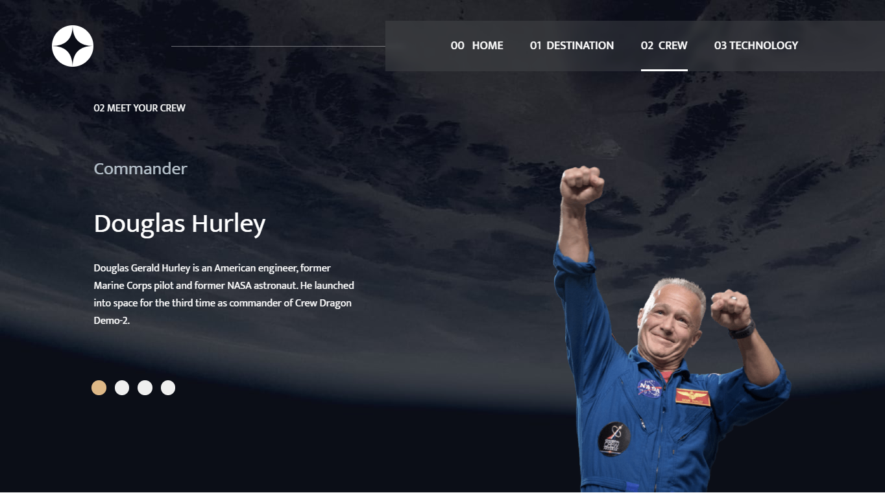
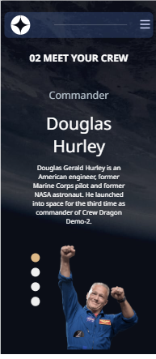

# Frontend Mentor - Space tourism website solution

This is a solution to the [Space tourism website challenge on Frontend Mentor](https://www.frontendmentor.io/challenges/space-tourism-multipage-website-gRWj1URZ3). Frontend Mentor challenges help you improve your coding skills by building realistic projects.

## Table of contents

- [Overview](#overview)
  - [The challenge](#the-challenge)
  - [Screenshot](#screenshot)
  - [Links](#links)
- [My process](#my-process)
  - [Built with](#built-with)
  - [What I learned](#what-i-learned)
  - [Continued development](#continued-development)
  - [Useful resources](#useful-resources)
- [Author](#author)
- [Acknowledgments](#acknowledgments)

**Note: Delete this note and update the table of contents based on what sections you keep.**

## Overview

### The challenge

Users should be able to:

- View the optimal layout for each of the website's pages depending on their device's screen size
- See hover states for all interactive elements on the page
- View each page and be able to toggle between the tabs to see new information

### Screenshot






### Links

- Solution URL: [Add solution URL here](https://your-solution-url.com)
- Live Site URL: [Add live site URL here](https://your-live-site-url.com)

## My process

### Built with

- Semantic HTML5 markup
- CSS custom properties
- Flexbox

### What I learned

Use this section to recap over some of your major learnings while working through this project. Writing these out and providing code samples of areas you want to highlight is a great way to reinforce your own knowledge.

I learned how to use the fetch API on local JSON file

```js
fetch("/data.json");
```

To see how you can add code snippets, see below:

````js

const proudOfThisFunc = () => {
function LoopBtnListener(obj, fxn, loopBtn, className) {
  loopBtn.forEach((btn, i) => {
    btn.addEventListener("click", function () {
      loopBtn.forEach((btn) => {
        btn.classList.remove(className);
      });
      fxn(obj[i]);
      btn.classList.add(className);
    });
  });
}};

```
### Continued development

Integration with API
Asychronous Javascript
## Author

- Website - [AdedokunTimileyin] (https://www.linkedin.com/in/timileyin-adedokun-35b36b219)
- Frontend Mentor - [@TImley53] (https://www.frontendmentor.io/profile/yourusername)
- Twitter - [@timley_kun]  (https://www.twitter.com/yourusername)


````
